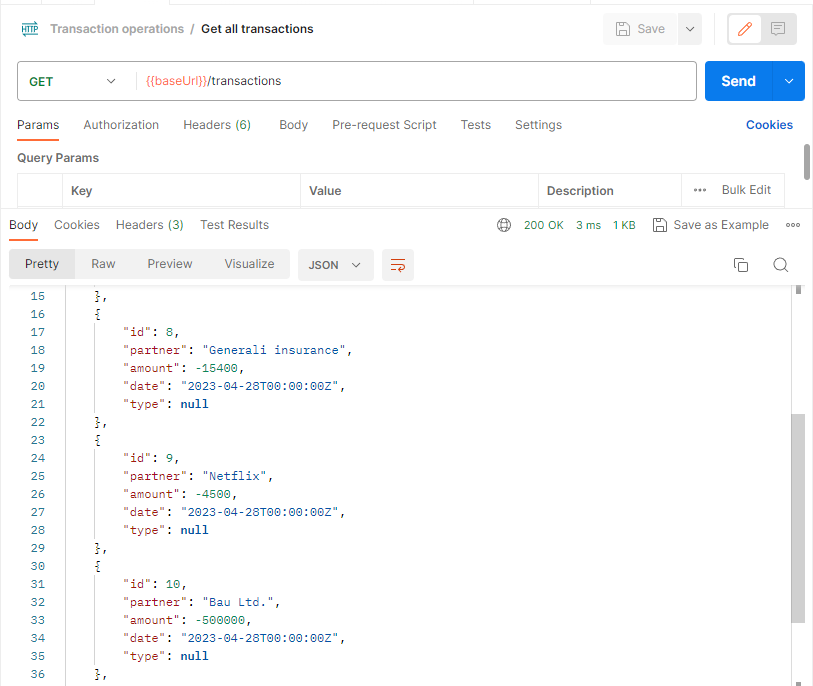
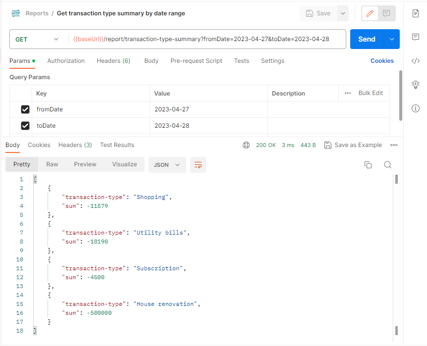
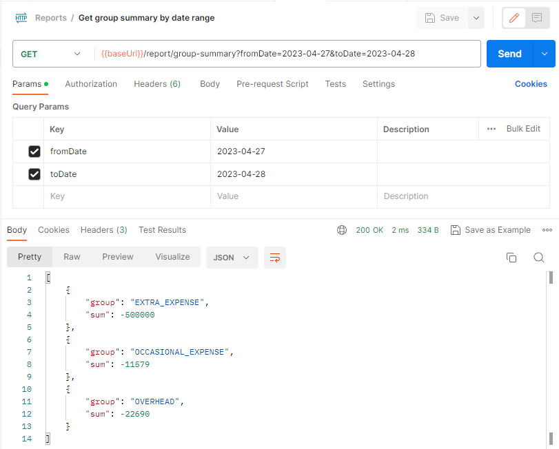

# transaction-organizer

Aim of this project is [Go](https://go.dev/) self-learning.

The implemented application is a REST API that facilitates the organization of banking transactions and generates reports from collected data.

Imported transactions can be assigned to user-specified transaction types. These transaction types belong to a predefined group, which allows for the creation of general reports about expenses.

## Project setup
1. Database initialization
   - Install PostgreSQL server
   - Create `transaction-organizer` database
   - Execute `db/db_init.sql` SQL script to create DB schema
2. Start application with `main.go`
   - Place of DB connection settings (username, password): `db/postgre-db.go`
3. Postman collection is available [here](https://www.postman.com/payload-explorer-83303472/workspace/transaction-organizer/overview) 

## Upload transactions
Transactions can be imported with an Excel file. The currently supported Excel file format is exported by K&H Bank. You can upload it through the `/transactions/kh?file-type=excel` POST endpoint.

An example Excel file can be found under `documentation-assets` folder: `test_kh.xlsx`

All the included transactions are saved without transaction type, which can be set later via `/transactions/:transactionId/type/:transactiondTypeId` PATCH endpoint.

## Get all transactions
Transactions can be fetched via `/transactions` GET endpoint.

## Create transaction types
The application does not define transaction types in advance. Users can define transaction types based on their requirements using the `/transaction-types` POST endpoint. Postman collection contains an example about the required RequestBody.

Each transaction type belongs to predefined **TransactionTypeGroup** which are the following:
- OVERHEAD
- OCCASIONAL_EXPENSE
- EXTRA_EXPENSE

## Fetch reports
Two types of reports are provided by API:
- Transaction type summary by date range 
- Group summary by date range 